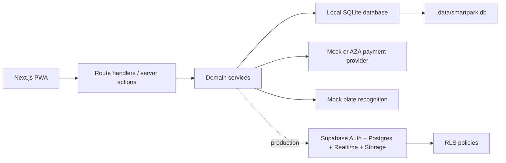
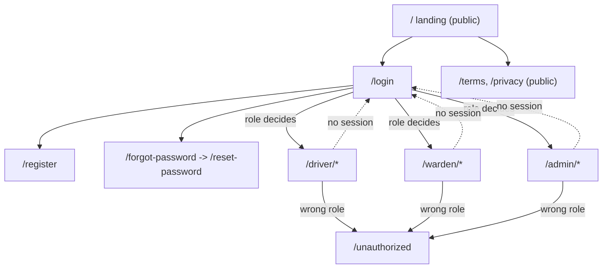
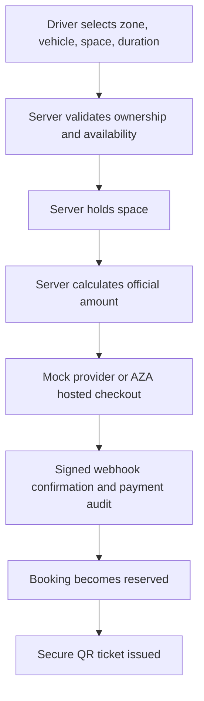
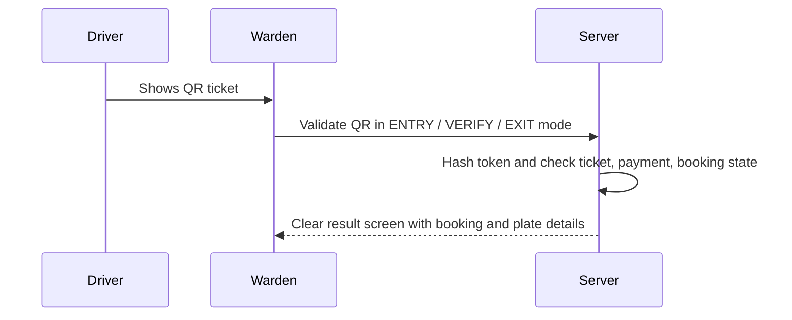

# SmartPark MVP

SmartPark is a simplified smart parking management system for city-centre parking fee collection and verification.
It provides one responsive PWA with role-based Driver, Warden, and Admin interfaces.

The MVP demonstrates this core path:

```text
Driver logs in -> selects zone and space -> completes secure checkout -> receives QR ticket
-> warden validates entry -> timer starts -> expired sessions create violations
-> warden checks plate and validates exit.
```

## Architecture



The backend runs entirely locally: route handlers and server actions call the domain services, which read and write a
SQLite database created from `src/server/schema.sql`. That schema mirrors `supabase/migrations/001_initial_schema.sql`,
which stays the production Postgres target, so the same workflows can later be pointed at a Supabase project.

## Technology Stack

- Next.js App Router, React, TypeScript strict mode
- Tailwind CSS with lightweight accessible components
- React Hook Form and Zod validation
- MapLibre GL JS with OpenStreetMap-compatible tiles
- QR generation with `qrcode.react`
- Browser QR scanning with `html5-qrcode`
- SQLite persistence through `node:sqlite`, with a Supabase/Postgres migration as the production target
- Vitest unit/integration tests and Playwright E2E scaffolding

## Local Setup

```bash
corepack enable
corepack pnpm install
corepack pnpm dev
```

`pnpm dev` automatically creates `.env.local` from the safe committed template when the file is missing. To inspect
configuration without printing secrets, run `corepack pnpm env:check`.

If PowerShell blocks package-manager shims, use:

```powershell
$env:COREPACK_HOME="$PWD\.corepack"
corepack pnpm install
corepack pnpm dev
```

## Demo Credentials

```text
Driver: driver@smartpark.test / password123
Warden: warden@smartpark.test / password123
Admin: admin@smartpark.test / password123
```

Public users can register only as drivers. Warden/admin accounts are seeded or admin-created.

## Environment Variables

The app creates `.env.local` automatically and starts in mock-payment mode. Open it with `notepad .env.local` from
PowerShell and fill real values only when moving beyond demo mode. See `docs/environment-setup.md` for local and Vercel
steps.

Server secrets:

```text
MOCK_PAYMENT_WEBHOOK_SECRET
QR_TOKEN_PEPPER
```

`SMARTPARK_DB_PATH` overrides the database location; it defaults to `.data/smartpark.db` and accepts `:memory:` for a
throwaway run.

AZA hosted checkout:

```text
PAYMENT_PROVIDER=aza
AZA_API_BASE_URL=https://api.aza.systems
AZA_API_KEY=aza_test_...
AZA_WEBHOOK_SECRET=...
```

Register `https://your-domain/api/payments/aza-webhook` in the AZA merchant dashboard. See
`docs/payment-integration.md` for the full setup and webhook event list.

Admin users can open **Admin > Settings** to see redacted readiness, copy the webhook URL, and test the AZA API key.

Never expose service-role keys, payment secrets, webhook secrets, or QR pepper values in client code.

## Local Database

The database is created and seeded on first start, so there is no setup step. Schema changes go in
`src/server/schema.sql`, and the table specs in `src/server/db.ts` are checked against it at boot so the two cannot
drift apart silently.

```bash
corepack pnpm db:reset   # delete .data/smartpark.db; the next start re-seeds it
```

## Supabase Setup (production target)

1. Create a Supabase project.
2. Run `supabase/migrations/001_initial_schema.sql`.
3. Create driver, warden, and admin auth users.
4. Insert matching `profiles` records with the correct role.
5. Point the services at Supabase repositories in place of `src/server/store.ts`.

## Web Flow

Notes on how a person actually moves through the app: which routes are public, where the
server redirects them, and what each request touches on the way in. Read this alongside
`src/lib/auth.ts` and the three role layouts.

### Route map



### Who can reach what

| Route group | Signed out | Wrong role | Implemented in |
| --- | --- | --- | --- |
| `/`, `/login`, `/register`, `/forgot-password`, `/reset-password`, `/terms`, `/privacy`, `/offline` | Renders | n/a | Individual pages |
| `/driver/*` | Redirect to `/login` | Redirect to `/unauthorized` | `src/app/driver/layout.tsx` |
| `/warden/*` | Redirect to `/login` | Redirect to `/unauthorized` | `src/app/warden/layout.tsx` |
| `/admin/*` | Redirect to `/login` | Redirect to `/unauthorized` | `src/app/admin/layout.tsx` |
| `/api/*` | Handler-dependent | Handler-dependent | Each route handler |
| Anything else | Custom 404 | Custom 404 | `src/app/not-found.tsx` |

**There is no `middleware.ts`.** Every guard is a `requireRole()` call inside the role
layout, which runs on the server before any markup for that segment is produced. This is
deliberate: the check lives next to the page it protects, so a new route under
`/warden/` inherits the guard by being in the folder. The trade-off is that guarding is
per-segment rather than global - if a fourth role area is added, its layout has to call
`requireRole()` too. Nothing else will do it.

### Per-role journeys

**Driver.** `/login` -> `/driver` (dashboard) -> `/driver/map` to compare zones, or
`/driver/scan` to enter a zone code from a physical sign -> `/driver/book/[zoneId]`
(vehicle, space, duration) -> `/driver/payment` -> `/driver/payment-result` ->
`/driver/ticket/[bookingId]`. During a session the driver lives on `/driver/active`,
which can extend or cancel. `/driver/history`, `/driver/vehicles` and `/driver/wallet`
sit off the main path.

**Warden.** `/login` -> `/warden` (live dashboard) -> `/warden/scanner` to validate a
ticket in entry, status or exit mode -> `/warden/plates` when there is no ticket to scan
-> `/warden/violations` to confirm or dismiss what the expiry sweep raised.
`/warden/spaces` is the read-only occupancy view.

**Admin.** `/login` -> `/admin` -> `/admin/zones` (each zone renders its own printable QR
sign), `/admin/spaces`, `/admin/wardens`, `/admin/settings`.

### What every request touches

1. **Route handler or page** reads the request and nothing else.
2. **Zod** parses the input. A failure returns 400 with field issues via `jsonError()`.
3. **`requireRole()`** resolves the session cookie to a user and checks the role.
4. **Domain service** (`src/server/smartpark-service.ts`) prices, validates transitions
   and decides. This is the only layer allowed to say yes.
5. **Store** mutates the in-memory state and calls `markDirty()`.
6. **SQLite** receives the snapshot on the next tick.

Errors never leak past step 6: `src/lib/api.ts` maps `DomainError` to its own status,
`ZodError` to a 400, and anything unrecognised to a 500, so no handler invents its own
error shape.

### Notes and gotchas

- **Redirect, do not hide.** A driver who types `/admin` is redirected to
  `/unauthorized`, not shown a 404. Hiding a nav link is not access control, and
  pretending a route does not exist tells an attacker less than nothing useful.
- **Breadcrumbs are auth-only.** `/login`, `/register`, `/forgot-password` and
  `/reset-password` carry a breadcrumb trail because they sit outside the app shell and
  have no other way back. Inside `/driver`, `/warden` and `/admin` the shell's own
  navigation does that job, so adding breadcrumbs there would duplicate it.
- **The shell adapts, it does not branch.** `AppShell` takes a `nav` array from each role
  layout. There is no role check inside the component; it renders whatever the server
  already decided this user may see.
- **Two pages poll.** `/driver/map` and the `/warden` dashboard mount `AutoRefresh`,
  which calls `router.refresh()` every 15 seconds and only while the tab is visible.
  It is a stand-in for live subscriptions, not a substitute - see Future Improvements.
- **Session is a plain cookie.** `smartpark_user_id` is `httpOnly` and `sameSite=lax`
  with an 8-hour lifetime, but it is **not signed**. Anyone who can set the cookie can
  assume that user id. This is acceptable for a local demo and is the first thing to fix
  before any deployment.
- **`/offline` is served by the service worker**, not linked from the UI. It only appears
  when the PWA is installed and the network is gone.
- **The role tutorial is an overlay, not a route.** `RoleTutorial` renders over the
  dashboard on first visit for each role and records completion in `localStorage` under
  `smartpark-tutorial-<role>-v1`. It has no URL, so it cannot be linked to or skipped by
  navigation - clear that key to see it again when rehearsing a demo.

## Booking Workflow



Booking statuses:

```text
pending_payment -> reserved -> active -> completed
pending_payment -> payment_failed
reserved -> cancelled
active -> expired
expired -> completed
```

## Payment Architecture

The payment provider is abstracted behind one server interface. Local demo mode uses `MockPaymentProvider`; AZA mode
creates a hosted checkout session and waits for a signed `checkout.completed` webhook. Browser-submitted prices and
success claims are ignored; the server recalculates the amount from zone price and selected duration. AZA request and
webhook retry IDs are stored for idempotency.

## QR Validation Flow



The QR payload contains only:

```json
{ "type": "smartpark-ticket", "token": "secure-random-token" }
```

The database stores only a hash of the token.

## Timer and Expiration

The official timer is server-based. Entry sets `check_in_time` and `end_time`. The frontend countdown is display-only.
`expireOverdueBookings()` marks overdue active bookings as expired and creates one open violation per booking.

## Number-Plate Verification

Manual plate search is implemented and normalizes spaces/punctuation/case. A mock recognition provider is included as
an extension point, but OCR is not required for normal operation and cannot automatically confirm violations.

## Scripts

```bash
corepack pnpm dev
corepack pnpm lint
corepack pnpm typecheck
corepack pnpm test
corepack pnpm test:e2e
corepack pnpm build
corepack pnpm db:reset
corepack pnpm seed
corepack pnpm env:setup
corepack pnpm env:check
```

## Security Assumptions

This MVP is not production-ready for real-money deployment without a security review. The design includes secure
defaults: RLS migration, server-side role checks, hashed QR tokens, mock webhook verification, audit logs, and no
client-side service keys. Production work must review payment provider integration, webhook replay protection, rate
limiting, logging, data retention, and operational enforcement policies.

## Known Limitations

- The local backend writes the whole state as one SQLite snapshot, which suits demo-sized data but not concurrent
  multi-instance deployment.
- Sessions are a plain user-id cookie; there is no token signing, refresh, or revocation yet.
- Supabase repositories are documented but not wired up.
- AZA integration requires merchant KYB, an API key, a signing secret, and a public HTTPS deployment before live use.
- Real plate recognition remains a provider placeholder.
- Realtime subscriptions are represented in the architecture and migration plan, not fully connected in demo mode.
- Playwright browser binaries may need installation before E2E tests can run.

## Future Improvements

- Replace the snapshot store with row-level repositories, then with Supabase adapters.
- Add Supabase Realtime subscriptions for zone and dashboard updates.
- Add production rate limiting and observability.
- Integrate the provided payment system through the payment adapter.
- Add a real OCR/ANPR provider behind the mock plate-recognition interface.


PAYMENT_PROVIDER=aza
AZA_API_KEY=your_real_key
AZA_WEBHOOK_SECRET=your_webhook_secret
AZA_API_BASE_URL=https://api.aza.systems
NEXT_PUBLIC_APP_URL=https://your-app.vercel.app

https://your-app.vercel.app/api/payments/aza-webhook


Launch SmartPark on Your PC
1. Open PowerShell.
2. Enter:
cd "C:\Users\Forge Mages\Documents\SmartPark"
$env:COREPACK_HOME="$PWD\.corepack"
corepack pnpm dev -H 127.0.0.1
3. Wait until you see:
Ready
Local: http://127.0.0.1:3000
4. Open this address in your browser:
http://127.0.0.1:3000
5. Keep PowerShell open while using SmartPark.
6. To stop the app, return to PowerShell and press:
Ctrl + C
If it says port 3000 is already in use, SmartPark is probably already running. Open the address directly instead of starting another copy.
