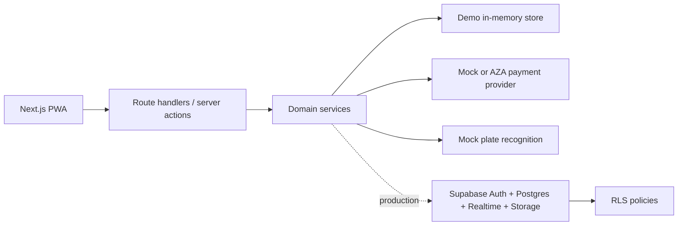
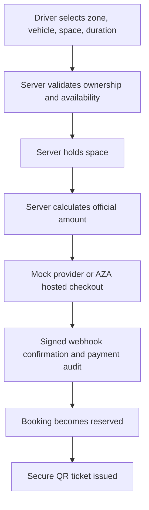
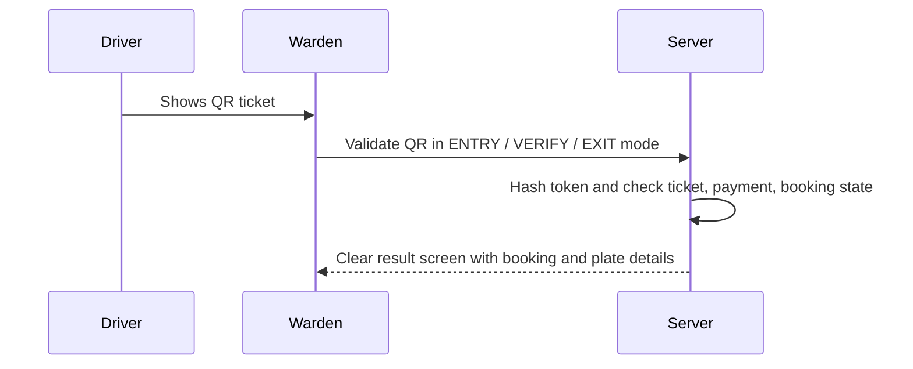

# SmartPark MVP

SmartPark is a simplified smart parking management system for city-centre parking fee collection and verification.
It provides one responsive PWA with role-based Driver, Warden, and Admin interfaces.

The MVP demonstrates this core path:

```text
Driver logs in -> selects zone and space -> completes secure checkout -> receives QR ticket
-> warden validates entry -> timer starts -> expired sessions create violations
-> warden checks plate and validates exit.
```

## Architecture



The checked-in app runs in demo mode without Supabase credentials. The Supabase schema, RLS policies, and adapter
placeholders are included so the same workflows can be backed by a real Supabase project.

## Technology Stack

- Next.js App Router, React, TypeScript strict mode
- Tailwind CSS with lightweight accessible components
- React Hook Form and Zod validation
- MapLibre GL JS with OpenStreetMap-compatible tiles
- QR generation with `qrcode.react`
- Browser QR scanning with `html5-qrcode`
- Supabase-ready schema, Auth placeholders, and RLS migrations
- Vitest unit/integration tests and Playwright E2E scaffolding

## Local Setup

```bash
corepack enable
corepack pnpm install
corepack pnpm dev
```

`pnpm dev` automatically creates `.env.local` from the safe committed template when the file is missing. To inspect
configuration without printing secrets, run `corepack pnpm env:check`.

If PowerShell blocks package-manager shims, use:

```powershell
$env:COREPACK_HOME="$PWD\.corepack"
corepack pnpm install
corepack pnpm dev
```

## Demo Credentials

```text
Driver: driver@smartpark.test / password123
Warden: warden@smartpark.test / password123
Admin: admin@smartpark.test / password123
```

Public users can register only as drivers. Warden/admin accounts are seeded or admin-created.

## Environment Variables

The app creates `.env.local` automatically and starts in mock-payment mode. Open it with `notepad .env.local` from
PowerShell and fill real values only when moving beyond demo mode. See `docs/environment-setup.md` for local and Vercel
steps.

Required for production-backed Supabase:

```text
NEXT_PUBLIC_SUPABASE_URL
NEXT_PUBLIC_SUPABASE_ANON_KEY
SUPABASE_SERVICE_ROLE_KEY
MOCK_PAYMENT_WEBHOOK_SECRET
QR_TOKEN_PEPPER
```

AZA hosted checkout:

```text
PAYMENT_PROVIDER=aza
AZA_API_BASE_URL=https://api.aza.systems
AZA_API_KEY=aza_test_...
AZA_WEBHOOK_SECRET=...
```

Register `https://your-domain/api/payments/aza-webhook` in the AZA merchant dashboard. See
`docs/payment-integration.md` for the full setup and webhook event list.

Admin users can open **Admin > Settings** to see redacted readiness, copy the webhook URL, and test the AZA API key.

Never expose service-role keys, payment secrets, webhook secrets, or QR pepper values in client code.

## Supabase Setup

1. Create a Supabase project.
2. Run `supabase/migrations/001_initial_schema.sql`.
3. Create driver, warden, and admin auth users.
4. Insert matching `profiles` records with the correct role.
5. Replace the demo store with Supabase repositories behind the existing service interfaces.

## Booking Workflow



Booking statuses:

```text
pending_payment -> reserved -> active -> completed
pending_payment -> payment_failed
reserved -> cancelled
active -> expired
expired -> completed
```

## Payment Architecture

The payment provider is abstracted behind one server interface. Local demo mode uses `MockPaymentProvider`; AZA mode
creates a hosted checkout session and waits for a signed `checkout.completed` webhook. Browser-submitted prices and
success claims are ignored; the server recalculates the amount from zone price and selected duration. AZA request and
webhook retry IDs are stored for idempotency.

## QR Validation Flow



The QR payload contains only:

```json
{ "type": "smartpark-ticket", "token": "secure-random-token" }
```

The database stores only a hash of the token.

## Timer and Expiration

The official timer is server-based. Entry sets `check_in_time` and `end_time`. The frontend countdown is display-only.
`expireOverdueBookings()` marks overdue active bookings as expired and creates one open violation per booking.

## Number-Plate Verification

Manual plate search is implemented and normalizes spaces/punctuation/case. A mock recognition provider is included as
an extension point, but OCR is not required for normal operation and cannot automatically confirm violations.

## Scripts

```bash
corepack pnpm dev
corepack pnpm lint
corepack pnpm typecheck
corepack pnpm test
corepack pnpm test:e2e
corepack pnpm build
corepack pnpm seed
corepack pnpm env:setup
corepack pnpm env:check
```

## Security Assumptions

This MVP is not production-ready for real-money deployment without a security review. The design includes secure
defaults: RLS migration, server-side role checks, hashed QR tokens, mock webhook verification, audit logs, and no
client-side service keys. Production work must review payment provider integration, webhook replay protection, rate
limiting, logging, data retention, and operational enforcement policies.

## Known Limitations

- Demo mode uses an in-memory store, so data resets when the server restarts.
- Supabase repositories are documented but not fully wired to the UI.
- AZA integration requires merchant KYB, an API key, a signing secret, and a public HTTPS deployment before live use.
- Real plate recognition remains a provider placeholder.
- Realtime subscriptions are represented in the architecture and migration plan, not fully connected in demo mode.
- Playwright browser binaries may need installation before E2E tests can run.

## Future Improvements

- Replace demo store with Supabase repository adapters.
- Add Supabase Realtime subscriptions for zone and dashboard updates.
- Add production rate limiting and observability.
- Integrate the provided payment system through the payment adapter.
- Add a real OCR/ANPR provider behind the mock plate-recognition interface.
