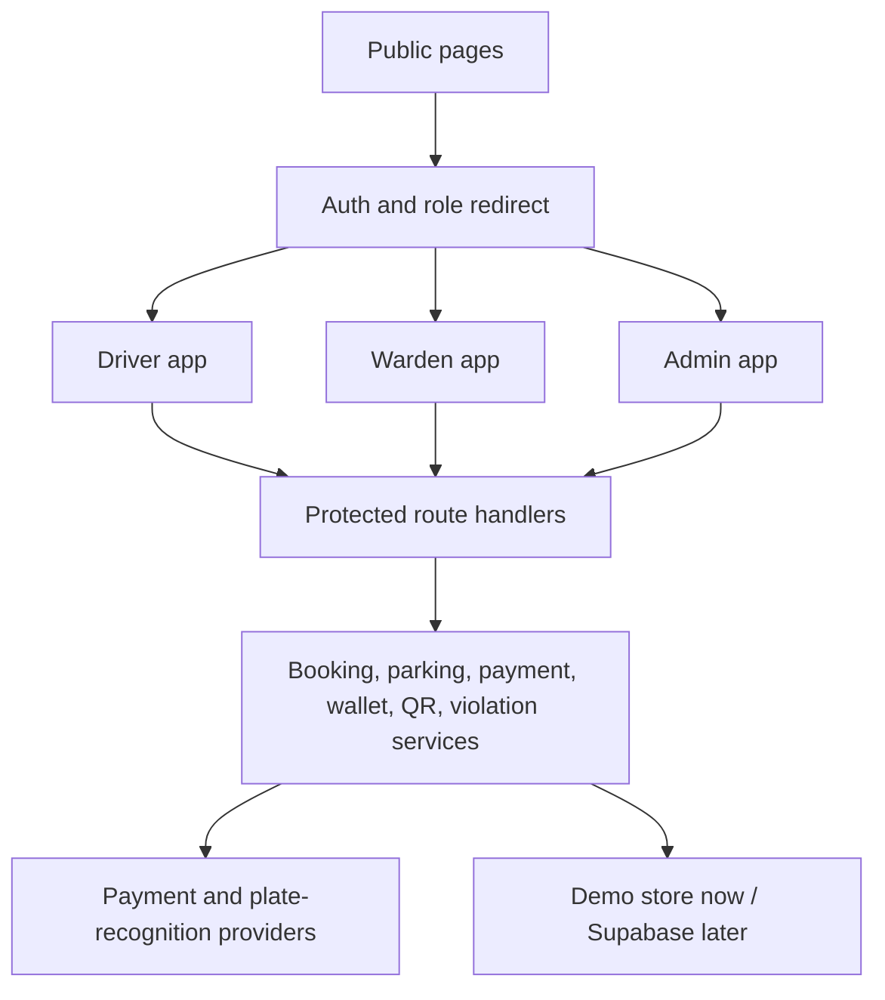

# Architecture

SmartPark uses one shared Next.js codebase with role-based interfaces. The MVP keeps business rules in server-side
domain services and leaves React components responsible for interaction and presentation.



## MVP Assumptions

- Supabase credentials are not available yet, so demo mode uses a server-side in-memory store.
- The payment provider is unspecified, so a mock wallet provider is implemented.
- Number-plate recognition is optional, so manual plate search is the primary verification tool.
- The map shows parking-zone markers only, not routing, navigation, prediction, or street-level detection.

## Source Layout

```text
src/app               App Router pages and route handlers
src/components        Reusable UI and workflow components
src/lib               Auth, env, API, Supabase placeholders
src/server            Domain types, seed data, services, providers
supabase/migrations   SQL schema and RLS
docs                  Architecture and operation notes
```
