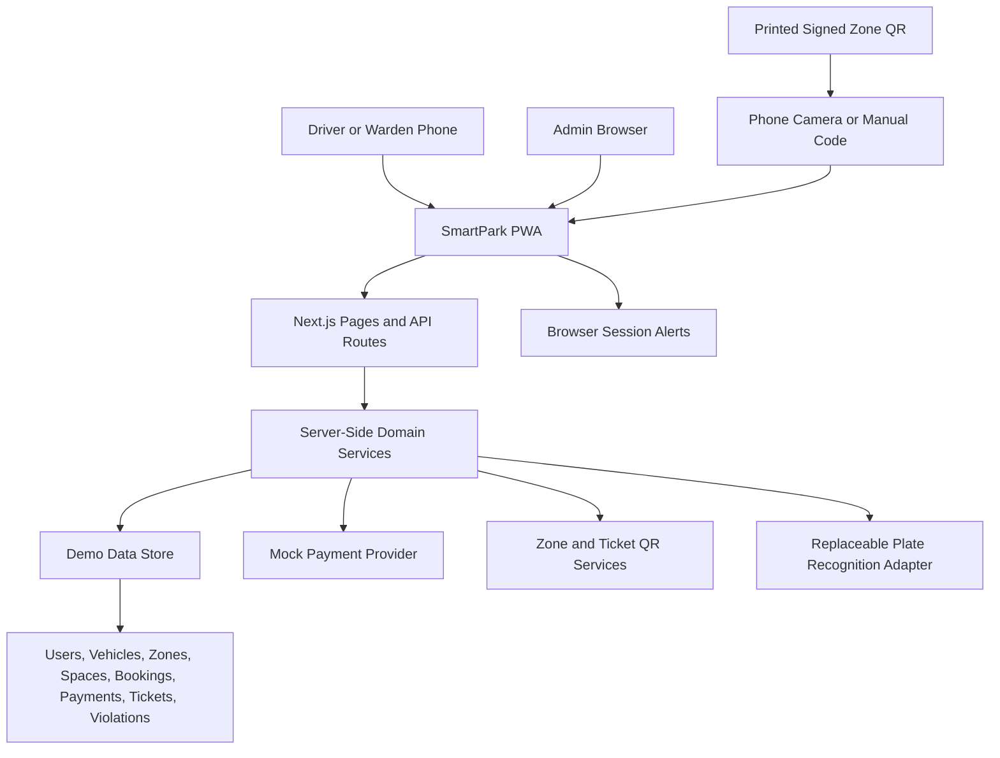
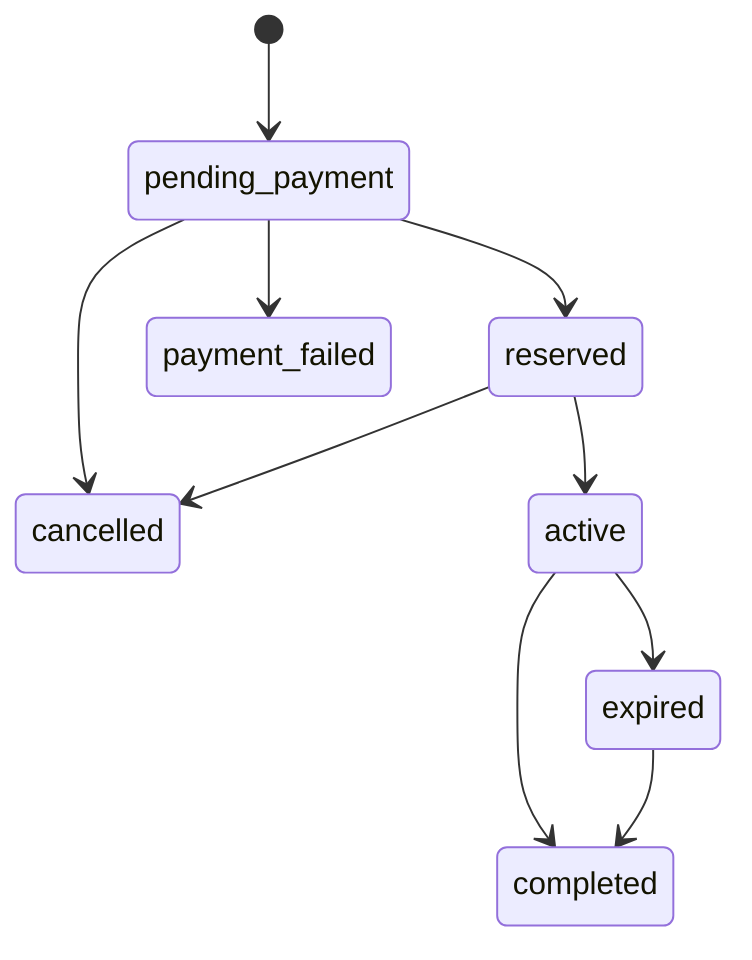
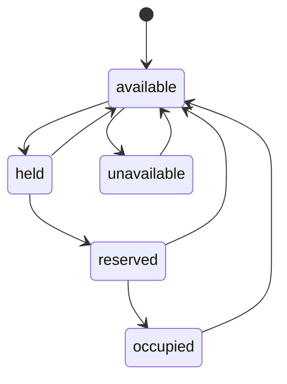

# Chapter Four: Design Specifications

## 4.1 Introduction

This chapter describes the design specifications of SmartPark. It explains how the system is structured, the methodology used in designing the application, the major system interfaces, and the requirement model. The design is based on the requirements identified in Chapter Three and focuses on providing a simple, secure, and usable parking management system.

SmartPark is designed as a role-based, phone-first application with three main users: Driver, Warden, and Admin. Each user has a different interface and level of access, but all users rely on the same backend logic and data model. This helps maintain consistency in booking, payment, signed zone-code resolution, QR validation, session extension, plate verification, and violation management.

## 4.2 System Design and Methodology

SmartPark uses a modular system design. The application is divided into frontend interfaces, backend services, data storage, and external service adapters. This design makes the system easier to understand, test, maintain, and extend.

The project follows an MVP-based methodology. Instead of depending on IoT occupancy sensors, automated barriers, or fixed number-plate cameras, the design uses phones, printed zone signs, server-side records, and human confirmation. The core digital parking workflow is:

```text
Driver scans or selects a zone -> System ranks suitable zones -> Driver pays -> QR ticket is generated -> Warden validates ticket -> Timer runs or is extended -> Exit or prioritised violation is recorded
```

This methodology helps ensure that the core system can be demonstrated clearly without unnecessary complexity.

### 4.2.1 Overall System Architecture

SmartPark is designed as a responsive Progressive Web Application that can be used from ordinary driver and warden phones. The current implementation uses a demo backend store for demonstration, while the database structure is prepared for Supabase PostgreSQL.



The architecture contains the following major layers:

1. **Presentation Layer**: This contains the user interfaces for drivers, wardens, admins, and public users.
2. **Application Layer**: This contains route handlers, server actions, and user workflow control.
3. **Domain Service Layer**: This contains the main business rules for booking, payment, QR validation, wallet handling, and violations.
4. **Data Layer**: This contains the data structures and database design for storing system records.
5. **Provider Layer**: This contains replaceable providers for payment and number-plate recognition.
6. **Device Capability Layer**: This uses phone cameras, optional geolocation, and browser notifications with manual fallbacks.

### 4.2.2 Role-Based Design

The system is divided into three main user roles.

| Role | Main Purpose |
| --- | --- |
| Driver | Finds or scans parking zones, books, pays, receives QR tickets, extends time, and views sessions |
| Warden | Monitors activity, scans QR tickets, verifies plates, and handles priority-ranked violations |
| Admin | Views setup and produces signed printable QR signs for parking zones |

Role-based access helps prevent users from performing actions outside their responsibility. For example, a driver should not access the warden dashboard, and a warden should not modify payment records or wallet balances.

### 4.2.3 Booking Design

The booking system is designed around controlled state transitions. This prevents invalid changes to booking records.



The booking process follows these steps:

1. The driver scans a signed zone QR code, enters a visible zone code, or selects a zone from the map.
2. The map may rank zones by best match, distance, or price and displays availability confidence.
3. The driver selects a vehicle, space, and duration.
4. The server calculates the official parking amount.
5. The selected space is temporarily held.
6. The payment provider processes the payment.
7. After payment confirmation, the booking becomes reserved.
8. A secure QR ticket is generated.
9. The warden validates the ticket at entry.
10. The booking becomes active and the timer starts.
11. The driver may pay to extend an eligible active session.
12. The booking is completed when the warden validates exit.

### 4.2.4 Parking-Space Design

Parking spaces also use controlled statuses.



The `held` state is important because it prevents two drivers from booking the same space while payment is being processed.

### 4.2.5 QR Ticket Design

QR tickets are used as the main verification method. The QR code contains only a secure token and does not store personal or financial information.

Example QR payload:

```json
{
  "type": "smartpark-ticket",
  "token": "secure-random-token"
}
```

The raw token is shown only to the driver as a QR code. The system stores a hashed version of the token for security.

### 4.2.6 Payment Design

The payment system is designed using a provider-adapter approach. This means the current mock payment provider can later be replaced by a real payment provider without redesigning the whole system.

Payment rules:

1. The server calculates the final parking amount.
2. The browser does not decide whether payment is successful.
3. A booking becomes valid only after payment confirmation.
4. Wallet balances are updated only by server-side logic.
5. Payment and wallet records are stored for audit purposes.

### 4.2.7 Timer and Violation Design

The official timer is based on server timestamps. The browser may display a countdown, but the backend remains the source of truth.

The driver may extend an active session by a fixed duration when the wallet has sufficient funds. The server recalculates the price, debits the wallet, creates a ledger record, and changes the official end time. Browser alerts may notify the driver 15 minutes, 5 minutes, and immediately before expiry while the application is active and notification permission is available.

When a parking session exceeds the paid duration:

1. The booking becomes expired.
2. The QR ticket becomes expired.
3. A violation record is created.
4. The live overstay duration assigns watch, high, or critical priority.
5. The warden dashboard displays the violation in priority order.
6. The warden may confirm it or dismiss it only after recording a reason.

### 4.2.8 Signed Zone QR and Quick-Park Design

Each administered parking zone has a printable sign containing a QR payload signed by the server with a keyed hash. The payload identifies the SmartPark zone but contains no driver or payment data. The resolver rejects malformed or modified codes before showing the booking page. A short visible zone code provides an accessible fallback when camera permission is denied, the camera is damaged, or scanning conditions are poor.

This QR is different from the driver's paid ticket. The zone QR starts the booking process, while the ticket QR proves that a particular booking has been paid for and is eligible for entry, verification, or exit.

### 4.2.9 Availability Confidence and Recommendation Design

Because the project does not use physical occupancy sensors, availability is derived from booking, ticket-validation, and warden-verification records. Each zone displays one of three confidence levels:

1. **Warden verified**: recent field verification supports the displayed status.
2. **Session estimate**: current bookings and validations support the estimate.
3. **Limited signal**: there is insufficient recent information for strong confidence.

The map offers Best, Closest, and Cheapest modes. Best combines price, estimated available spaces, confidence, and optional distance. Geolocation is optional; without it, the user can still compare zones by price and availability.

### 4.2.10 Session Extension and Alert Design

Extension is a server-authorised transaction. The driver selects an allowed increment, the server verifies ownership and active status, calculates the charge, debits the wallet, records the transaction, and updates the booking end time. Rejected extensions leave both the wallet and session unchanged.

Alerts are an assistance feature rather than the legal timer. The server timestamp remains authoritative even if notifications are blocked, the browser is closed, or the phone is offline.

### 4.2.11 Camera-Assisted Plate and Violation Priority Design

The warden can capture or choose a plate image using a phone. A replaceable recognition adapter returns a suggested number and confidence score. The warden must review and confirm or correct the number before the system performs a validity search. This human-in-the-loop design prevents an uncertain recognition result from becoming an automatic enforcement decision.

Violations are ranked from live overstay duration: less than 15 minutes is watch, 15 to 29 minutes is high, and 30 minutes or more is critical. Priority helps the warden decide where to act first without replacing human judgement.

## 4.3 System Interfaces

SmartPark provides different interfaces for public users, drivers, wardens, and admins.

### 4.3.1 Public Interfaces

The public interface includes:

1. Landing page
2. Login page
3. Driver registration page
4. Forgot password page
5. Reset password page
6. Privacy notice
7. Terms page
8. Unauthorized page

Public users can only register as drivers. They cannot register as wardens or admins.

### 4.3.2 Driver Interfaces

The driver interface includes:

1. **Driver Dashboard**: Shows wallet balance, active booking status, and booking summary.
2. **Parking Map**: Displays parking zones and availability.
3. **Scan Zone Page**: Scans a signed parking-zone QR or accepts its visible code.
4. **Booking Page**: Allows the driver to choose vehicle, space, and duration.
5. **QR Ticket Page**: Displays the QR ticket generated after payment.
6. **Active Session Page**: Shows the official end time, countdown, alerts, and paid extension options.
7. **Vehicles Page**: Allows the driver to add and view vehicles.
8. **Wallet Page**: Displays wallet balance and transaction history.
9. **Booking History Page**: Shows previous and current bookings.
10. **Profile Page**: Displays driver profile information.

The map provides Best, Closest, and Cheapest modes, optional phone-location ranking, and confidence labels so that estimated availability is not presented as sensor-certified fact.

### 4.3.3 Warden Interfaces

The warden interface includes:

1. **Warden Dashboard**: Shows summary of spaces, active sessions, expired sessions, and violations.
2. **Spaces Page**: Displays a visual grid of parking-space statuses.
3. **QR Scanner Page**: Allows wardens to validate entry, verify active parking, and validate exit.
4. **Plate Search Page**: Accepts manual entry or phone-camera capture, shows recognition confidence, and requires confirmation.
5. **Violations Page**: Displays live overstay duration and priority and requires a reason for dismissal.
6. **Warden Profile Page**: Shows warden account information.

### 4.3.4 Admin Interfaces

The admin interface includes:

1. **Admin Dashboard**: Shows system setup summary.
2. **Parking Zones Page**: Shows parking zones, pricing, visible codes, and printable signed QR signs.
3. **Parking Spaces Page**: Shows space information and statuses.
4. **Warden Management Page**: Shows warden accounts.
5. **System Settings Page**: Shows basic configuration information.

### 4.3.5 API Interfaces

SmartPark includes protected API routes for important operations.

| API Route | Purpose |
| --- | --- |
| `/api/bookings` | Creates a booking and starts mock payment |
| `/api/bookings/active` | Gets the active driver booking |
| `/api/bookings/[bookingId]/cancel` | Cancels an eligible reservation |
| `/api/bookings/[bookingId]/extend` | Charges for and extends an eligible active session |
| `/api/vehicles` | Adds and lists driver vehicles |
| `/api/zones` | Lists parking zones |
| `/api/zones/resolve-qr` | Verifies a signed zone code and resolves its booking destination |
| `/api/zones/[zoneId]/spots` | Lists available spaces in a zone |
| `/api/qr/validate` | Validates QR tickets for entry, status check, or exit |
| `/api/plates/search` | Searches a vehicle number plate |
| `/api/plates/recognize` | Returns a reviewable plate suggestion and confidence from the mock adapter |
| `/api/violations/[violationId]` | Confirms or dismisses violations |
| `/api/warden/dashboard` | Provides warden dashboard data |
| `/api/payments/mock-webhook` | Demonstrates mock payment webhook processing |

## 4.4 Requirement Model: Use Case Descriptions

The requirement model describes how users interact with the system to complete tasks.

### 4.4.1 Driver Books Parking

| Item | Description |
| --- | --- |
| Use Case | Book Parking Space |
| Actor | Driver |
| Precondition | Driver is logged in and has a registered vehicle |
| Main Flow | Driver selects zone, selects space, chooses duration, reviews amount, pays, and receives QR ticket |
| Postcondition | Booking becomes reserved and QR ticket is issued |
| Exception | If payment fails, booking becomes payment failed and space is released |

### 4.4.2 Warden Validates Entry

| Item | Description |
| --- | --- |
| Use Case | Validate Entry |
| Actor | Warden |
| Precondition | Driver has a reserved booking and valid QR ticket |
| Main Flow | Warden scans QR ticket, system verifies payment and booking status, booking becomes active |
| Postcondition | Parking timer starts and space becomes occupied |
| Exception | Invalid, expired, cancelled, or unpaid tickets are rejected |

### 4.4.3 Warden Verifies Parking Status

| Item | Description |
| --- | --- |
| Use Case | Verify Parking Status |
| Actor | Warden |
| Precondition | Warden is logged in |
| Main Flow | Warden scans QR ticket or searches plate number, system displays booking and payment status |
| Postcondition | Verification event is recorded |
| Exception | Unknown tickets or plates return a not-found result |

### 4.4.4 Warden Validates Exit

| Item | Description |
| --- | --- |
| Use Case | Validate Exit |
| Actor | Warden |
| Precondition | Booking is active or expired |
| Main Flow | Warden scans QR ticket in exit mode, system completes booking and releases space |
| Postcondition | Booking becomes completed and space becomes available |
| Exception | Repeated exit attempts are rejected |

### 4.4.5 System Detects Expired Session

| Item | Description |
| --- | --- |
| Use Case | Detect Expired Parking |
| Actor | System |
| Precondition | Booking is active and end time has passed |
| Main Flow | System marks booking as expired, expires QR ticket, and creates violation |
| Postcondition | Warden dashboard displays violation alert |
| Exception | Duplicate violations are prevented |

### 4.4.6 Admin Views System Setup

| Item | Description |
| --- | --- |
| Use Case | View System Setup |
| Actor | Admin |
| Precondition | Admin is logged in |
| Main Flow | Admin views zones, spaces, wardens, and settings |
| Postcondition | Admin understands current system configuration |
| Exception | Non-admin users are redirected away from admin pages |

### 4.4.7 Driver Scans a Parking Zone

| Item | Description |
| --- | --- |
| Use Case | Scan Parking Zone |
| Actor | Driver |
| Precondition | Driver is logged in and is near a SmartPark zone sign |
| Main Flow | Driver scans the signed zone QR, server verifies it, and the booking page opens for that zone |
| Postcondition | The correct zone is selected without manual map searching |
| Exception | A damaged or invalid code is rejected; the visible zone code can be entered manually |

### 4.4.8 Driver Extends an Active Session

| Item | Description |
| --- | --- |
| Use Case | Extend Parking Session |
| Actor | Driver |
| Precondition | Driver owns an active booking and has sufficient wallet balance |
| Main Flow | Driver selects an extension, server calculates and debits the charge, and the end time is updated |
| Postcondition | Wallet ledger and booking show the extension |
| Exception | Expired, completed, unauthorised, or underfunded requests are rejected without changing data |

### 4.4.9 Warden Performs Camera-Assisted Plate Check

| Item | Description |
| --- | --- |
| Use Case | Camera-Assisted Plate Verification |
| Actor | Warden |
| Precondition | Warden is logged in and has camera access or an existing image |
| Main Flow | Warden captures a plate, reviews recognition confidence, confirms or corrects the plate, and runs the search |
| Postcondition | Validity details are displayed and the verification is recorded |
| Exception | If recognition fails, the warden enters the plate manually; no automatic enforcement occurs |

## 4.5 Database Design Overview

The database design supports the major records used in the system.

| Table | Purpose |
| --- | --- |
| `profiles` | Stores user profile and role information |
| `vehicles` | Stores driver vehicle records |
| `parking_zones` | Stores parking location information |
| `parking_spots` | Stores individual parking spaces and statuses |
| `bookings` | Stores parking booking records |
| `payments` | Stores payment transaction records |
| `wallet_accounts` | Stores user wallet balances |
| `wallet_transactions` | Stores wallet ledger entries |
| `qr_tickets` | Stores QR ticket hashes and statuses |
| `verification_events` | Stores QR and plate verification logs |
| `violations` | Stores violation records |
| `audit_logs` | Stores sensitive system activity |

The database is designed with role-based access, unique constraints, indexes, and status fields to protect system integrity.

## 4.6 Summary

This chapter explained the design specifications of SmartPark. It covered the system architecture, methodology, booking design, parking-space design, signed zone and ticket QR codes, payment, availability confidence, recommendations, session extensions, alerts, camera-assisted plate checks, priority-ranked violations, interfaces, use cases, and database overview.

The design supports a practical parking-management workflow using ordinary phones and printed signs. It also allows future improvement through real payment integration, Supabase persistence, secure background notifications, a validated recognition provider, realtime updates, and mobile-app packaging, without making IoT infrastructure a requirement.
