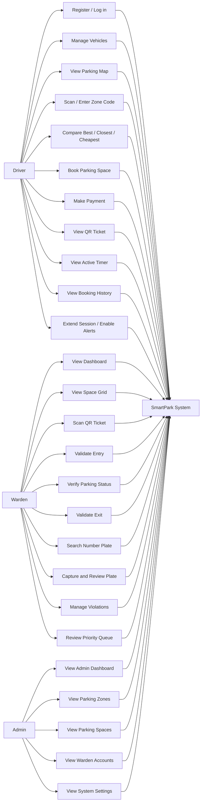

# Chapter Three: Requirements Specifications

## 3.1 Introduction

This chapter presents the requirements specification for SmartPark, a simplified smart parking management system. The purpose of the requirements specification is to define what the system should do, the users it should support, the conditions under which it should operate, and the resources needed for successful implementation.

The requirements are grouped into functional requirements, non-functional requirements, hardware requirements, requirements analysis, and use-case modelling. These requirements guide the design and implementation of the SmartPark system.

## 3.2 Requirements Gathering

Requirements gathering is the process of identifying the needs of the users and stakeholders of the system. For SmartPark, the major stakeholders are drivers, parking wardens, system administrators, and parking management authorities.

The requirements were gathered by analysing the problems associated with manual parking fee collection and by reviewing the expected workflow of a digital parking system. The project also considered the need for a simple system that can be demonstrated without complex physical infrastructure such as automatic barriers, IoT sensors, and CCTV monitoring.

The main requirement-gathering activities included:

1. Identifying the parking problems faced by drivers and wardens.
2. Defining the major user roles of the system.
3. Determining the core workflow from booking to payment and exit validation.
4. Reviewing existing parking applications and smart parking concepts.
5. Identifying the data that must be stored, such as users, vehicles, spaces, bookings, payments, tickets, and violations.
6. Defining security needs for payments, wallet records, QR tickets, and user access.
7. Selecting development tools suitable for a responsive MVP.

From this process, the system was divided into three main user interfaces: Driver, Warden, and Admin.

## 3.3 Functional Requirements

Functional requirements describe the specific operations the system must perform. SmartPark must provide different functions depending on the user role.

### 3.3.1 Driver Functional Requirements

The driver should be able to:

1. Register for an account.
2. Log in to the system.
3. View and update their profile.
4. Add and manage vehicle details.
5. View parking zones on a simplified map.
6. View available parking spaces in a selected zone.
7. View parking prices before booking.
8. Select a vehicle, parking space, and duration.
9. Review the calculated parking amount.
10. Pay for parking using a wallet or payment provider.
11. Receive a QR-code parking ticket after successful payment.
12. View an active parking session.
13. View the official parking timer after entry validation.
14. View booking history.
15. View wallet balance and transaction history.
16. Cancel eligible reservations where permitted.
17. Scan a signed SmartPark parking-zone QR code using a phone camera.
18. Enter a visible parking-zone code when camera scanning is unavailable.
19. Sort parking zones by best overall choice, closest location, or lowest price.
20. Choose whether to share device location for distance-based ranking.
21. View whether zone availability is warden verified, session estimated, or based on limited signals.
22. Extend an active parking session by 30, 60, or 90 minutes when permitted and when wallet funds are sufficient.
23. Enable 15-minute, 5-minute, and expiry alerts for an active session.
24. View the exact session end time alongside the countdown.

### 3.3.2 Warden Functional Requirements

The warden should be able to:

1. Log in to the system.
2. View a dashboard of parking activity.
3. View available, held, reserved, occupied, expired, and unavailable spaces.
4. View active parking sessions.
5. View expired parking sessions.
6. Scan QR-code tickets.
7. Validate ticket entry.
8. Verify active parking status.
9. Validate vehicle exit.
10. Search vehicle number plates manually.
11. View booking, vehicle, payment, and timer status during verification.
12. View violation alerts.
13. Confirm valid violations.
14. Dismiss false violations.
15. Add notes to violation records.
16. Capture a plate image using the phone camera or image picker.
17. Review the detected plate number and recognition-confidence percentage before verification.
18. Correct an incorrectly detected plate before searching.
19. View violation alerts ordered by critical, high, or watch priority.
20. Open the plate-verification screen directly from a violation alert.
21. Provide a reason before dismissing a violation alert.
22. Continue manual plate entry when camera recognition is unavailable.

### 3.3.3 Admin Functional Requirements

The admin should be able to:

1. Log in to the admin section.
2. View system overview information.
3. View parking zones.
4. View parking spaces.
5. View warden accounts.
6. View system settings.
7. View and print signed QR codes for active parking zones.
8. Manage parking zones and spaces in a future production version.
9. Manage warden accounts in a future production version.

The admin section is intentionally limited in the MVP because the main focus of the project is the driver and warden parking workflow.

### 3.3.4 System Functional Requirements

The system should be able to:

1. Authenticate users and redirect them based on role.
2. Prevent drivers from accessing warden and admin pages.
3. Prevent wardens from modifying wallet balances or payment records.
4. Calculate parking fees on the server.
5. Hold a parking space temporarily while payment is being processed.
6. Prevent two drivers from booking the same parking space.
7. Confirm payment before making a booking valid.
8. Generate secure QR-code tickets.
9. Store only a secure hash of the QR ticket token.
10. Change booking and parking-space statuses according to valid state transitions.
11. Detect expired parking sessions.
12. Create violation records for expired sessions.
13. Record verification events for QR scans and plate searches.
14. Maintain audit information for sensitive actions.
15. Sign parking-zone QR payloads and reject altered or unverified zone codes.
16. Resolve a valid zone QR code to the corresponding active parking zone.
17. Calculate zone availability from the current software state without claiming physical sensor certainty.
18. Rank zones using availability ratio, price, optional distance, and confidence weight.
19. Calculate extension prices on the server and record each extension payment in the wallet ledger.
20. Update open violation overstay duration when the dashboard is refreshed.
21. Rank open violations by live overstay severity.
22. Require human confirmation before a camera-detected plate is treated as a warden verification.

## 3.4 Non-Functional Requirements

Non-functional requirements describe how the system should perform rather than the specific functions it provides.

### 3.4.1 Usability

The system should be easy to use by both drivers and wardens. Drivers should be able to complete a parking booking with minimal steps. Wardens should be able to quickly identify space status, expired sessions, and ticket validity.

### 3.4.2 Responsiveness

The application should work on desktop, tablet, and mobile screen sizes. Since wardens may use tablets or mobile devices while inspecting vehicles, the interface should remain clear and usable on smaller screens.

### 3.4.3 Security

The system should protect user data, payment records, wallet balances, booking information, plate images, and location information. Users should only access information permitted by their role. Payment success should be confirmed by the backend, not by the browser. Ticket QR codes should not expose personal or financial information. Zone QR codes should be digitally signed so that altered codes are rejected. Location access and browser notifications should require user permission.

### 3.4.4 Reliability

The system should handle repeated scans, duplicate payment callbacks, expired sessions, invalid tickets, altered zone QR codes, denied location permission, and failed network requests safely. It should not create duplicate violations for the same expired session, and it should keep overstay duration current for open violations.

### 3.4.5 Maintainability

The project should be organised so that future developers can update or replace modules without rewriting the entire system. For example, the mock payment provider should be replaceable with a real payment provider, and the mock plate-recognition provider should be replaceable with a real recognition service.

### 3.4.6 Performance

The system should load quickly and avoid unnecessary complex features. The map should show parking-zone markers only, and the dashboard should focus on useful status information rather than heavy analytics.

### 3.4.7 Scalability

Although the MVP is simplified, the structure should allow future expansion. More parking zones, more wardens, additional payment providers, and mobile-app packaging can be added later.

### 3.4.8 Accessibility

The system should use readable text, clear labels, visible status indicators, and accessible form controls. Users should be able to understand system messages such as successful booking, invalid QR ticket, expired session, and payment failure.

### 3.4.9 Privacy

Number plates, vehicle images, parking locations, and violation histories may identify individuals. The production system should collect only necessary information, restrict access by role, define plate-image retention periods, record enforcement actions, and comply with applicable data-protection requirements. Routine plate checks should not retain an image longer than necessary unless it forms part of a confirmed violation record.

## 3.5 Hardware Requirements

SmartPark is mainly a software-based system and does not require specialised parking hardware for the MVP. However, some basic hardware is needed for development, demonstration, and use.

### 3.5.1 Development Hardware Requirements

The developer requires:

1. A laptop or desktop computer.
2. Minimum 8 GB RAM, recommended 16 GB RAM.
3. At least 10 GB of free storage for project files and dependencies.
4. Stable internet connection for installing dependencies and using map tiles.
5. Modern web browser such as Chrome, Edge, or Firefox.

### 3.5.2 Driver Hardware Requirements

The driver requires:

1. A smartphone, tablet, or computer with a modern browser.
2. Internet connection.
3. Screen capable of displaying the QR ticket.
4. Camera capable of scanning a printed parking-zone QR sign, where scan-to-park is used.

### 3.5.3 Warden Hardware Requirements

The warden requires:

1. A smartphone, tablet, or laptop.
2. Camera-enabled device for QR-code and plate-image capture.
3. Internet connection.
4. Modern web browser.

### 3.5.4 Parking-Site Materials

The parking site requires only low-cost, non-electronic materials for the MVP:

1. Printed SmartPark QR sign for each parking zone.
2. Clearly displayed human-readable zone code.
3. Visible parking-space codes where individual spaces are assigned.
4. No IoT sensor, automated barrier, fixed ANPR camera, or smart meter is required.

### 3.5.5 Server/Hosting Requirements

For production deployment, the system would require:

1. Web application hosting platform such as Vercel.
2. Supabase project for authentication and database storage.
3. Secure environment variable storage.
4. Payment provider credentials.
5. Optional storage service for uploaded plate-recognition images.

## 3.6 Requirements Analysis

Requirements analysis involves examining the gathered requirements to understand how they relate to the overall system. For SmartPark, the requirements show that the most important part of the system is the parking session lifecycle.

The driver begins the process by scanning a signed zone QR code, entering a zone code, or selecting a zone from the map. The driver may compare the best, closest, and cheapest options and may optionally allow location-based ranking. The system then accepts the vehicle, space, and duration, calculates the official amount, processes payment, creates a valid booking, and issues a secure QR ticket. This ticket becomes the main proof of parking permission.

The warden uses the system to verify that a vehicle has a valid booking. The warden may scan the QR ticket, enter the plate manually, or capture a plate image. Camera recognition remains advisory: the detected text and confidence must be reviewed before verification. If a booking has expired, the system creates or updates a violation alert and places it in a severity-ranked enforcement queue.

The admin supports the system by managing configuration data such as parking zones, spaces, wardens, and settings. However, admin functionality is limited in the MVP because the main purpose is to demonstrate the booking and verification workflow.

The following requirement priorities were identified:

| Priority | Requirement Area | Reason |
| --- | --- | --- |
| High | Driver booking and payment | This is the core parking workflow |
| High | QR ticket generation and validation | This is the primary verification method |
| High | Warden dashboard | Wardens need visibility of parking activity |
| High | Timer and expiration logic | Needed to detect overstayed parking sessions |
| High | Signed zone QR resolution | Enables fast, low-cost zone identification while rejecting altered codes |
| High | Availability confidence | Prevents estimated occupancy from being presented as sensor-confirmed fact |
| Medium | Session extension and alerts | Helps drivers avoid accidental overstay |
| Medium | Manual and camera-assisted plate search | Provides additional verification with human review |
| Medium | Violation priority queue | Helps wardens address the most serious overstays first |
| Medium | Admin setup views | Needed for basic configuration |
| Low | Production automatic plate recognition | Optional provider integration after accuracy and privacy evaluation |
| Low | Native mobile application | Future enhancement after web MVP |

The analysis shows that the MVP should focus on a complete and testable workflow rather than many advanced features.

## 3.7 Use Case Diagram

The use case diagram below shows the major interactions between the system actors and SmartPark.

### 3.7.1 Use Case Descriptions

| Use Case | Actor | Description |
| --- | --- | --- |
| Register / Log in | Driver | Allows a driver to create an account and access the system |
| Manage Vehicles | Driver | Allows a driver to add and view vehicle information |
| Scan / Enter Zone | Driver | Resolves a signed zone QR or visible zone code to the correct booking page |
| Compare Parking Zones | Driver | Ranks zones by best overall choice, distance, or price and shows availability confidence |
| Book Parking Space | Driver | Allows a driver to select a zone, space, duration, and vehicle |
| Make Payment | Driver | Allows a driver to pay for a parking booking |
| View QR Ticket | Driver | Displays the QR ticket generated after successful payment |
| Extend Session | Driver | Adds paid time to an eligible active parking session |
| Enable Session Alerts | Driver | Schedules visible expiry reminders with driver permission |
| View Dashboard | Warden | Shows parking activity and summary statistics |
| Scan QR Ticket | Warden | Allows a warden to verify a QR ticket |
| Search Number Plate | Warden | Allows manual verification of a vehicle plate number |
| Capture and Review Plate | Warden | Captures a phone image, displays suggested plate text and confidence, and requires confirmation |
| Manage Violations | Warden | Allows a warden to verify, confirm, or dismiss severity-ranked violation alerts |
| View System Settings | Admin | Allows an admin to inspect system configuration |

## 3.8 Summary

This chapter presented the requirements specification for SmartPark. It described how requirements were gathered, the functional requirements for drivers, wardens, admins, and the system, as well as the non-functional requirements such as usability, security, reliability, maintainability, and performance.

The chapter also described the hardware requirements, analysed the major requirement priorities, and presented a use case diagram showing the major interactions between users and the system. These requirements provide the foundation for the system design specifications discussed in the next chapter.
