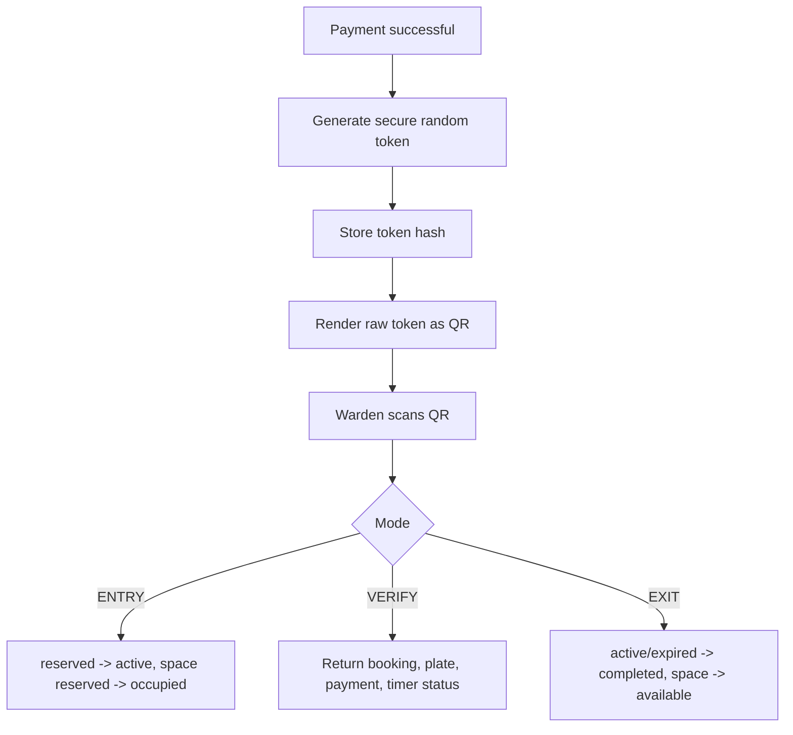

# QR Validation

SmartPark uses QR tickets as the primary verification method.

The QR payload must not include personal data, wallet data, payment credentials, or full booking details.

Repeated exit attempts, unknown tickets, revoked tickets, cancelled bookings, and unverified payments are rejected with
clear result messages.
